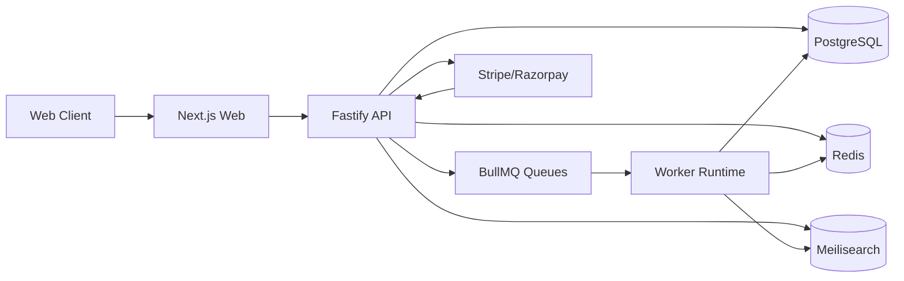
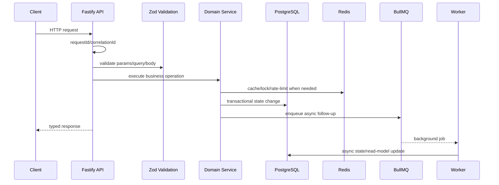
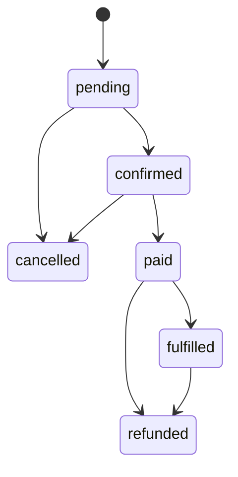
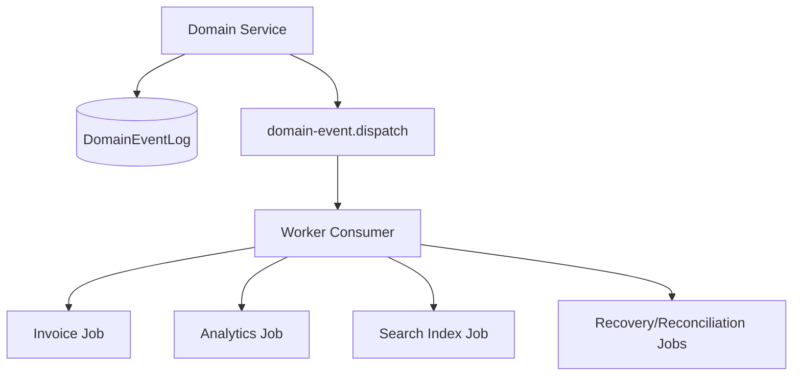
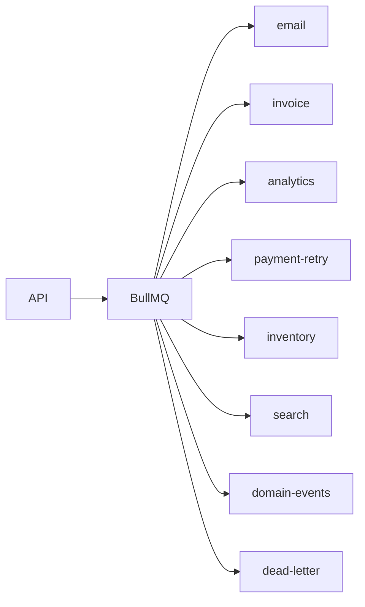
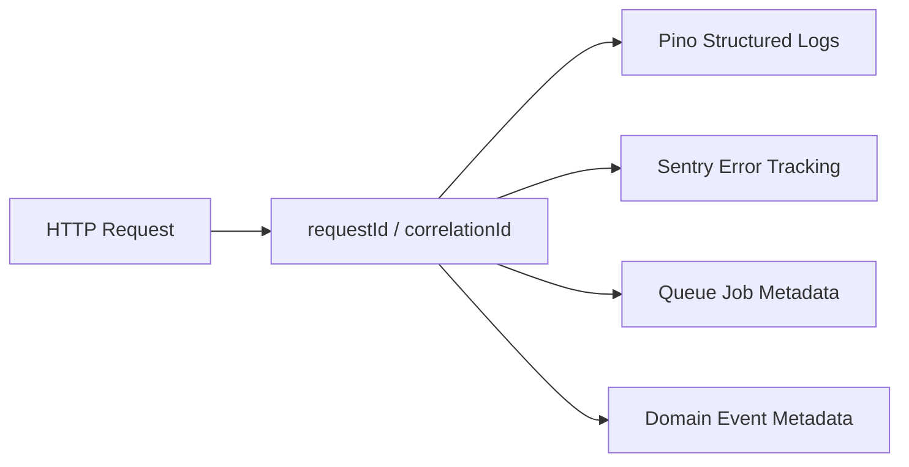
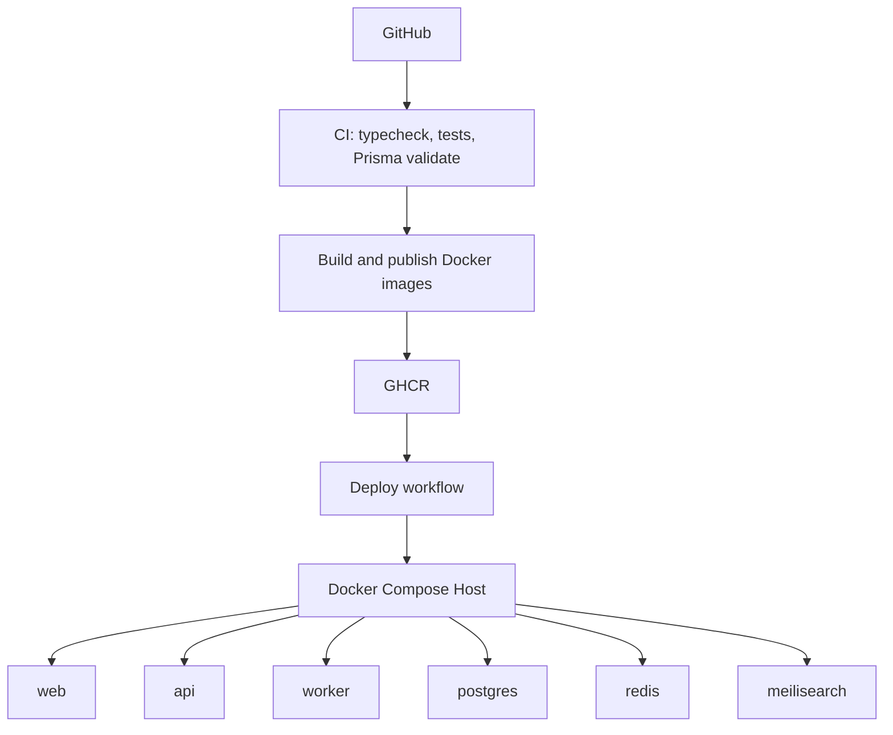

# Scalable Ecommerce Platform

A production-grade ecommerce backend and platform architecture built as a strict TypeScript monorepo. The project is designed to demonstrate startup-ready backend engineering: modular Fastify services, PostgreSQL/Prisma data modeling, Redis-backed distributed coordination, BullMQ workers, Meilisearch discovery, event-driven workflows, secure auth/payment patterns, and Docker-based deployment.

This is not a toy storefront. The repository focuses on the engineering foundation behind a scalable commerce system: consistency boundaries, operational safety, async processing, typed contracts, observability, and maintainable architecture.

## Tech Stack

| Layer | Technology |
| --- | --- |
| Monorepo | pnpm workspaces, Turborepo |
| Frontend | Next.js, React, TypeScript |
| API | Fastify, TypeScript, Zod, Pino |
| Data | PostgreSQL, Prisma |
| Cache and coordination | Redis |
| Async jobs | BullMQ |
| Search | Meilisearch |
| Auth | JWT access tokens, rotating refresh tokens, HTTP-only cookies, RBAC |
| Payments | Stripe/Razorpay-ready provider abstraction, signed webhooks |
| Observability | Structured logs, request/correlation IDs, Sentry-ready error tracking |
| Testing | Vitest, Supertest |
| Infrastructure | Docker, Docker Compose, GitHub Actions, GHCR |

## Repository Structure

```text
apps/
  web/                  Next.js frontend
  api/                  Fastify API service
  worker/               BullMQ worker runtime

packages/
  cache/                Redis cache, cart storage, inventory locks
  config/               Shared strict TypeScript/env configuration
  database/             Prisma schema and database package boundary
  events/               Typed domain event contracts and factories
  logger/               Structured logging foundation
  queue/                BullMQ queue names, schemas, routing, idempotency
  search/               Meilisearch client, documents, filters, ranking config
  types/                Shared DTO/type package
  ui/                   Shared frontend UI package
  validation/           Zod parsing and validation helpers

prisma/                 Root Prisma entrypoint mirror
.github/workflows/     CI, image publishing, deployment
```

## System Overview



The API owns synchronous request validation, auth, state transitions, and durable writes. Redis handles cache, locks, rate limits, carts, and queues. Workers process expensive or eventually consistent workflows: invoice generation, analytics, search indexing, payment retries, inventory cleanup, and domain-event reactions.

## Request Lifecycle



## Core Backend Domains

### Authentication and Authorization

Authentication uses short-lived JWT access tokens and rotating refresh tokens stored in HTTP-only cookies. Sessions are persisted for revocation and device tracking. RBAC middleware centralizes route authorization so business modules do not duplicate permission checks.

Security properties:

- no localStorage token storage
- refresh token rotation
- session invalidation
- CSRF strategy for cookie-backed refresh flows
- centralized error handling and validation formatting

Detailed doc: [AUTH_ARCHITECTURE.md](./AUTH_ARCHITECTURE.md)

### Product, Search, and Catalog

Products are modeled with categories, variants, images, inventory, and SEO-friendly slugs. Search is handled by Meilisearch rather than SQL `LIKE` queries. Product documents are denormalized for fast filtering and typo-tolerant discovery.

Search ranking prioritizes textual relevance first, then business signals:

- popularity
- availability
- recency

Detailed docs: [PRODUCT_ARCHITECTURE.md](./PRODUCT_ARCHITECTURE.md), [SEARCH_ARCHITECTURE.md](./SEARCH_ARCHITECTURE.md)

### Cart and Inventory

Carts use Redis for fast interaction and expiration while retaining a path to database persistence and recovery. Inventory reservations prevent overselling by combining Redis locks with PostgreSQL conditional updates.

The correctness boundary is the database, not the cache:

```sql
quantity - reserved - safetyStock >= requestedQuantity
```

Redis locks reduce contention; PostgreSQL transactions enforce stock integrity.

Detailed docs: [CART_ARCHITECTURE.md](./CART_ARCHITECTURE.md), [INVENTORY_RESERVATION.md](./INVENTORY_RESERVATION.md)

### Orders and Payments

Orders are managed through a controlled state machine. The platform does not expose uncontrolled status updates.



Payments are provider-confirmed, not frontend-confirmed. Signed webhooks update local payment state, and order/payment consistency is handled through transactional state transitions and reconciliation-ready records.

Detailed docs: [ORDER_ARCHITECTURE.md](./ORDER_ARCHITECTURE.md), [PAYMENT_ARCHITECTURE.md](./PAYMENT_ARCHITECTURE.md)

## Event-Driven Workflows

Domain events decouple producers from downstream reactions.



Supported event contracts:

- `OrderPlaced`
- `PaymentCompleted`
- `InventoryReserved`
- `CartExpired`
- `ProductUpdated`

Each event includes tenant, aggregate, correlation, causation, and schema version metadata. Consumers are expected to be idempotent, and queue job IDs are derived from event or aggregate identity.

Detailed doc: [EVENT_DRIVEN_ARCHITECTURE.md](./EVENT_DRIVEN_ARCHITECTURE.md)

## Queue Architecture

BullMQ powers async processing with typed job schemas, retry policies, and dead-letter concepts.



Async workloads include:

- email sending
- invoice generation
- analytics
- payment retries
- inventory reservation cleanup
- stock synchronization
- search indexing
- domain event dispatch

Detailed doc: [ASYNC_JOBS.md](./ASYNC_JOBS.md)

## Caching Strategy

Redis is used deliberately, not as a blanket replacement for the database.

| Use case | Strategy |
| --- | --- |
| Product/category reads | read-through cache with TTL |
| Hot products | short TTL cache |
| Carts | Redis-backed mutable cart state with expiration |
| Inventory | Redis locks plus database conditional writes |
| Rate limiting | tenant/IP scoped counters |
| Queues | BullMQ transport |

Cache invalidation is namespaced by tenant and domain. Product/catalog changes should emit domain events and enqueue search/cache refresh workflows.

Detailed doc: [CACHE_ARCHITECTURE.md](./CACHE_ARCHITECTURE.md)

## Database Design

The PostgreSQL schema is tenant-scoped and normalized around ecommerce boundaries:

- tenants, users, sessions, RBAC
- products, categories, variants, images
- carts and cart items
- inventory items and reservations
- orders and order events
- payments and webhook inbox
- audit logs
- domain event log

Indexing focuses on tenant-scoped access patterns, lifecycle queries, cursor pagination, cleanup jobs, and high-frequency lookup fields.

Detailed doc: [DATABASE_ARCHITECTURE.md](./DATABASE_ARCHITECTURE.md)

## Observability

Operational visibility is built around structured logs and correlation IDs.



The API attaches correlation data to requests, logs slow APIs, formats errors consistently, and carries request metadata into queue jobs and domain events.

Detailed doc: [OBSERVABILITY.md](./OBSERVABILITY.md)

## Infrastructure and Deployment

The platform ships with Docker and Docker Compose foundations for local and production-style deployment.



Included:

- local full-stack `docker-compose.yml`
- production image-based `docker-compose.prod.yml`
- app Dockerfiles
- health checks
- environment templates
- GitHub Actions CI
- GHCR image publishing
- manual deployment workflow

Detailed doc: [DEPLOYMENT_INFRASTRUCTURE.md](./DEPLOYMENT_INFRASTRUCTURE.md)

## Testing Strategy

The testing foundation uses Vitest and Supertest.

Coverage slices include:

- auth registration/session behavior
- payment webhook verification
- inventory reservation locking
- cart merge behavior
- order state-machine rules
- queue schema/routing/idempotency
- API health and error formatting

Integration tests are intentionally gated so local test runs stay fast and deterministic.

Detailed doc: [TESTING_STRATEGY.md](./TESTING_STRATEGY.md)

## Running Locally

Install dependencies:

```bash
corepack pnpm install
```

Run validation:

```bash
corepack pnpm typecheck
corepack pnpm test
```

Start the full local stack:

```bash
docker compose up --build
```

Useful local endpoints:

- Web: `http://localhost:3000`
- API health: `http://localhost:4000/health`
- Meilisearch: `http://localhost:7700`

## Engineering Tradeoffs

This project optimizes for maintainability and operational clarity over premature complexity.

Intentional choices:

- Fastify modules instead of a monolithic API file.
- PostgreSQL as source of truth.
- Redis for cache/coordination, not durable business state.
- BullMQ for async workflows before introducing Kafka/NATS.
- Meilisearch for product discovery instead of database text search.
- Docker Compose as a pragmatic deployment target before Kubernetes/ECS.
- Shared type packages for contracts across API, worker, and frontend.

Known next hardening steps:

- wire a concrete app-level Prisma client plugin into all production repositories
- switch internal package exports from TypeScript source to built `dist`
- add migration execution to deployment
- add worker heartbeat health checks
- add replay tooling for `DomainEventLog`
- add full integration tests against real Postgres/Redis/Meilisearch

## Design Documents

- [System Design](./SYSTEM_DESIGN.md)
- [Monorepo Architecture](./MONOREPO.md)
- [Database Architecture](./DATABASE_ARCHITECTURE.md)
- [Auth Architecture](./AUTH_ARCHITECTURE.md)
- [API Security](./API_SECURITY.md)
- [Cache Architecture](./CACHE_ARCHITECTURE.md)
- [Async Jobs](./ASYNC_JOBS.md)
- [Observability](./OBSERVABILITY.md)
- [Product Architecture](./PRODUCT_ARCHITECTURE.md)
- [Cart Architecture](./CART_ARCHITECTURE.md)
- [Inventory Reservation](./INVENTORY_RESERVATION.md)
- [Payment Architecture](./PAYMENT_ARCHITECTURE.md)
- [Order Architecture](./ORDER_ARCHITECTURE.md)
- [Search Architecture](./SEARCH_ARCHITECTURE.md)
- [Event-Driven Architecture](./EVENT_DRIVEN_ARCHITECTURE.md)
- [Testing Strategy](./TESTING_STRATEGY.md)
- [Deployment and Infrastructure](./DEPLOYMENT_INFRASTRUCTURE.md)
