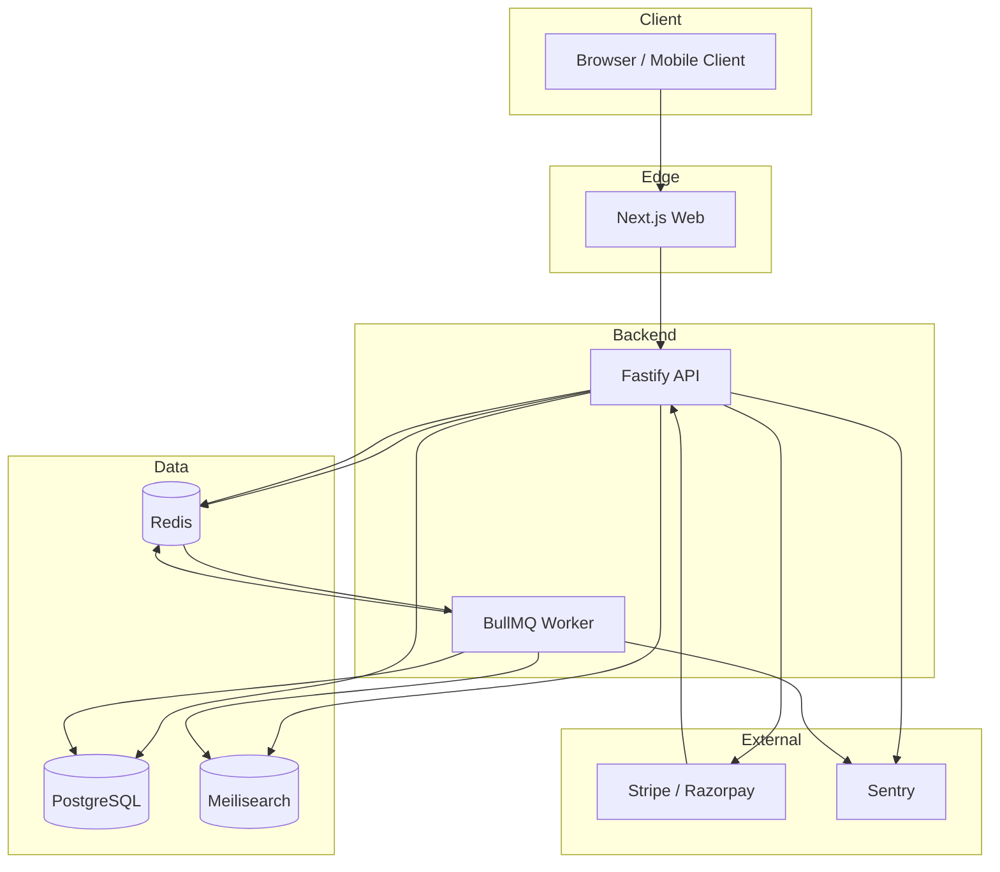
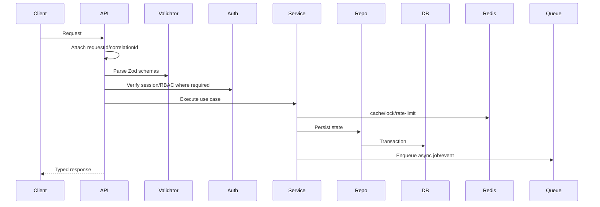
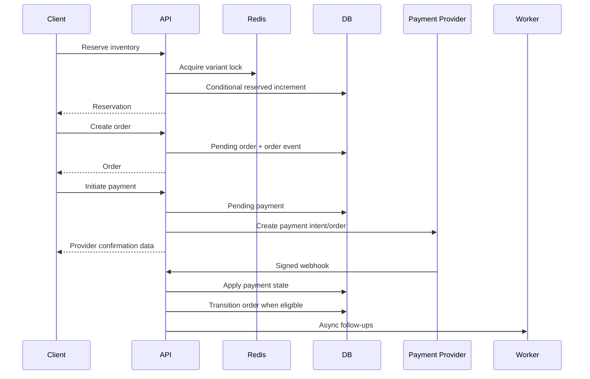
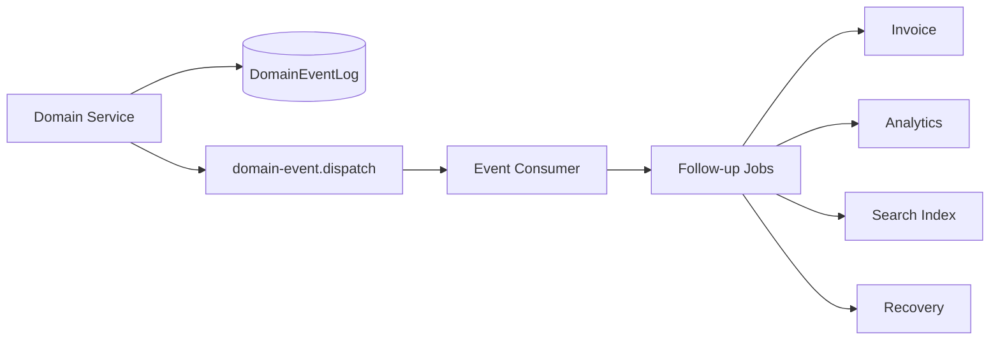
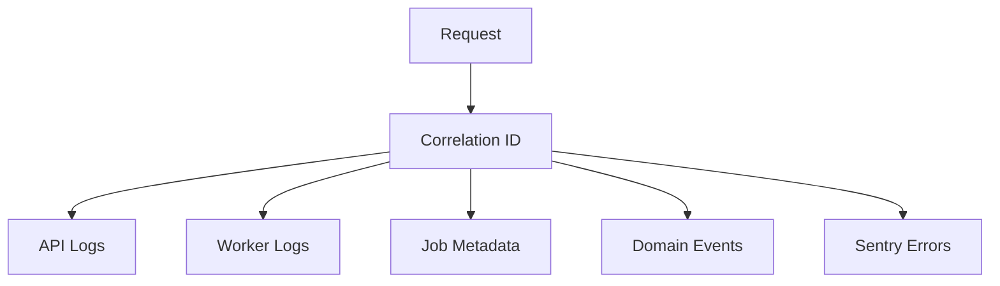
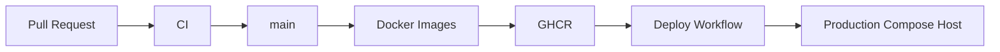

# System Design

This document describes the backend architecture and production reasoning behind the scalable ecommerce platform.

## Design Goals

- Preserve business correctness under concurrency.
- Keep modules independently maintainable.
- Favor explicit contracts over implicit coupling.
- Push slow or retryable work into async pipelines.
- Keep PostgreSQL as the source of truth.
- Use Redis, Meilisearch, and BullMQ for specialized workloads.
- Carry correlation metadata across requests, jobs, and events.

## High-Level Architecture



## Service Boundaries

### Web

The web app is intentionally thin. It talks to the API and does not own business-critical state transitions.

### API

The API owns:

- request validation
- authentication/authorization
- transactional writes
- state-machine enforcement
- idempotency boundaries
- durable event and job emission

Routes are thin. Business behavior lives in services and repositories.

### Worker

The worker owns:

- retries
- async side effects
- indexing
- invoice generation
- analytics
- cleanup jobs
- domain event reactions

This keeps user-facing requests fast and reduces synchronous coupling.

## Data Ownership

PostgreSQL is the source of truth for durable business state:

- users and sessions
- products and categories
- carts persisted state
- inventory and reservations
- orders and order events
- payments and webhook inbox
- audit logs
- domain event log

Redis is used for speed and coordination:

- cache
- carts
- distributed locks
- rate limits
- queue transport

Meilisearch is a query-optimized read model:

- product search
- category search
- autocomplete
- typo tolerance
- faceted filtering

## Request Lifecycle



Key rule: synchronous requests should complete only the work needed for correctness. Everything else moves to workers.

## Consistency Model

The platform uses strong consistency where money, inventory, and order state require it.

Strongly consistent:

- inventory reservation counters
- order state transitions
- payment webhook application
- audit and order event writes

Eventually consistent:

- search indexing
- analytics
- invoice generation
- email
- cache refresh
- product read models

This model keeps checkout safe while allowing the rest of the platform to scale through async processing.

## Checkout Consistency



The frontend never marks orders as paid. Payment provider webhooks and reconciliation jobs establish payment truth.

## Inventory Oversell Prevention

Inventory availability is enforced by PostgreSQL conditional updates:

```sql
UPDATE "InventoryItem"
SET "reserved" = "reserved" + $quantity
WHERE "tenantId" = $tenantId
  AND "variantId" = $variantId
  AND ("quantity" - "reserved" - "safetyStock") >= $quantity
```

Redis locks reduce hot-SKU contention, but they are not the correctness boundary. The database is.

## Event-Driven Workflows



Events are facts, not commands. Consumers decide how to react.

Examples:

- `OrderPlaced` -> invoice generation, analytics
- `PaymentCompleted` -> analytics, reconciliation hooks
- `ProductUpdated` -> search indexing
- `CartExpired` -> analytics/recovery
- `InventoryReserved` -> analytics/monitoring

## Queue and Retry Strategy

BullMQ queues are separated by workload:

- email
- invoice
- analytics
- payment retry
- stock sync
- inventory cleanup
- search
- domain events
- dead letter

Each job type has:

- Zod schema
- queue routing
- retry count
- exponential backoff
- idempotency key

This prevents background work from becoming an untyped dumping ground.

## Security Architecture

Security is layered:

- strict env validation
- secure auth token storage
- refresh token rotation
- RBAC middleware
- CSRF protection strategy
- security headers
- CORS configuration
- centralized validation
- rate limiting
- webhook signature verification
- no frontend-trusted payment success

Secrets are runtime environment values, not image-baked values.

## Observability Architecture



The system is designed so an operator can follow one checkout or payment across:

- HTTP request logs
- database state
- queue jobs
- worker logs
- domain events
- error reports

## Scaling Decisions

### API Scaling

The API is stateless aside from external dependencies. It can scale horizontally behind a load balancer as long as all instances share:

- PostgreSQL
- Redis
- Meilisearch
- secrets

### Worker Scaling

Workers scale horizontally by queue concurrency and replica count. Workloads are isolated by queue name so high-volume analytics does not starve payment retries or inventory cleanup.

### Database Scaling

Initial scale relies on:

- tenant-scoped indexes
- cursor-friendly ordering
- normalized schema
- transactional correctness
- cleanup indexes

Later scale options:

- read replicas
- partitioning by tenant/time for event and audit tables
- managed Postgres
- archival pipelines for old events/logs

### Search Scaling

Meilisearch is a read model. Product writes enqueue indexing jobs, and search can lag behind PostgreSQL briefly without corrupting core business state.

### Cache Scaling

Redis handles speed and coordination. Cache misses degrade to source-of-truth reads; they do not change correctness.

## Performance Considerations

- Keep routes thin and avoid synchronous heavy work.
- Use cursor pagination for high-volume lists.
- Use denormalized search documents for product discovery.
- Cache catalog reads with explicit TTLs.
- Avoid holding DB transactions across external network calls.
- Use bounded batch sizes for cleanup/rebuild jobs.
- Use queue concurrency per workload.

## Deployment Architecture



Current deployment target is Docker Compose because it is pragmatic and transparent for a portfolio/startup-grade foundation. The same service boundaries can move to Kubernetes, ECS, Nomad, or a managed platform later.

## Tradeoffs

| Decision | Benefit | Tradeoff |
| --- | --- | --- |
| BullMQ before Kafka | simpler ops, strong fit for jobs | less suitable for high-volume event streaming |
| Compose deployment | low operational overhead | limited autoscaling/rollout controls |
| Meilisearch | excellent ecommerce search UX | eventually consistent with DB |
| Redis carts | fast UX and expiration | requires persistence/recovery strategy |
| Domain events | decoupled workflows | consumers must be idempotent |
| Strict TypeScript | safer refactors | more upfront modeling |

## Current Production Readiness

Implemented foundations:

- strict TypeScript monorepo
- modular API and worker structure
- Prisma ecommerce schema
- Redis cache/locks/carts
- BullMQ queues
- Meilisearch search layer
- secure auth architecture
- payment webhook architecture
- order state machine
- event-driven workflows
- testing foundation
- Docker/Compose/CI/CD
- observability primitives

Next hardening steps:

- wire concrete Prisma clients into all route modules
- emit domain events directly from completed domain transactions
- run database migrations in deploy workflow
- add real integration test environment
- add worker heartbeat checks
- add dashboards and alerting
- switch package runtime exports from TS source to built `dist`
